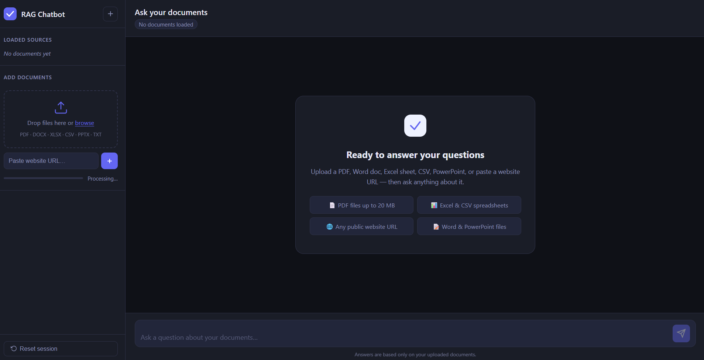

# 🤖 RAG AI Chatbot

> A full-stack Retrieval-Augmented Generation (RAG) chatbot for asking grounded questions over uploaded documents and website content.

[](https://www.python.org/)
[](https://fastapi.tiangolo.com/)
[](https://faiss.ai/)
[](https://en.wikipedia.org/wiki/Retrieval-augmented_generation)
[](#license)

## 📌 Overview

This project is a local-first, document-aware AI chatbot built around the **Retrieval-Augmented Generation (RAG)** architecture.

Instead of sending a user's question directly to an LLM, the application first searches a vector index for relevant information from the user's knowledge base. The retrieved context is then supplied to the answer-generation layer so that responses are grounded in the available source material.

### Why RAG?

LLMs can produce confident answers that are not supported by a user's private documents. RAG reduces this problem by adding a retrieval step:

```text
User Question
      ↓
Question Embedding
      ↓
Semantic Search
      ↓
Relevant Document Chunks
      ↓
Context + Prompt
      ↓
LLM
      ↓
Grounded Answer + Sources
```

---

## ✨ Features

- 📄 **Multi-format document ingestion**
  - PDF
  - DOCX
  - XLSX / XLS
  - CSV
  - PPTX
  - TXT
  - Markdown
- 🌐 **Website URL ingestion**
- 🧩 **Text extraction and chunking**
- 🔢 **Vector embeddings**
- 🔍 **FAISS semantic similarity search**
- 🧠 **Retrieval-Augmented Generation**
- 📚 **Source/reference viewing**
- ⚡ **Streaming responses with Server-Sent Events (SSE)**
- 🎯 **Relevance thresholding** to reduce unsupported answers
- 🖥️ **Local/CPU-friendly deployment**
- 🔌 **Multiple answer-generation modes**, depending on configuration

---

## 🏗️ Architecture

```text
┌─────────────────────┐
│       User          │
│ File / URL / Query  │
└──────────┬──────────┘
           │
           ▼
┌─────────────────────┐
│   Web Frontend      │
│ HTML / CSS / JS     │
└──────────┬──────────┘
           │ HTTP / SSE
           ▼
┌─────────────────────┐
│     FastAPI         │
│      Backend        │
└───────┬─────┬───────┘
        │     │
        │     └──────────────────┐
        ▼                        ▼
┌───────────────┐        ┌────────────────┐
│   Document    │        │ Query / RAG    │
│   Processor   │        │    Engine      │
└───────┬───────┘        └───────┬────────┘
        │                         │
        ▼                         ▼
┌───────────────┐        ┌────────────────┐
│ Text Chunks   │        │ Query Embedding│
└───────┬───────┘        └───────┬────────┘
        │                         │
        ▼                         ▼
┌──────────────────────────────────────────┐
│              FAISS Index                │
│        Semantic Similarity Search       │
└─────────────────────┬────────────────────┘
                      │
                      ▼
             ┌─────────────────┐
             │ Relevant Context│
             └────────┬────────┘
                      ▼
             ┌─────────────────┐
             │   LLM Backend   │
             └────────┬────────┘
                      ▼
             ┌─────────────────┐
             │ Answer + Sources│
             └─────────────────┘
```

---

## 🔄 RAG Pipeline

1. **Ingest** a document or website.
2. **Extract** readable content.
3. **Clean and chunk** the text.
4. **Generate embeddings** for each chunk.
5. **Index vectors** in FAISS.
6. Convert the user's question into an embedding.
7. **Retrieve top-k relevant chunks**.
8. Apply the configured **relevance threshold**.
9. Send retrieved context to the selected answer-generation backend.
10. Return the answer and allow the user to inspect source passages.

---

## 🛠️ Tech Stack

| Layer | Technology |
|---|---|
| Language | Python |
| API / Backend | FastAPI |
| Frontend | HTML, CSS, JavaScript |
| Vector Search | FAISS |
| Embeddings | FastEmbed |
| PDF Processing | PyMuPDF |
| DOCX Processing | python-docx |
| Spreadsheet Processing | openpyxl |
| PowerPoint Processing | python-pptx |
| Web Content | BeautifulSoup |
| Configuration | python-dotenv |
| Streaming | Server-Sent Events (SSE) |
| Local LLM | Ollama |
| Other LLM Options | OpenAI / local model modes, depending on configuration |

---

## 📂 Project Structure

```text
rag-chatbot/
├── backend/
│   ├── main.py
│   ├── rag_engine.py
│   └── document_processor.py
│
├── frontend/
│   ├── index.html
│   ├── app.js
│   └── style.css
│
├── data/
│   ├── uploads/
│   └── vector_store/
│
├── docs/
│   ├── chatbot-home.png
│   ├── document-upload.png
│   ├── chat-response.png
│   └── source-citations.png
│
├── .env.example
├── .gitignore
├── requirements.txt
├── start.bat
├── start.sh
└── README.md
```

> The `docs/` image files are placeholders for your own screenshots. Add screenshots there after running the application.

---

## ⚙️ Requirements

- Python **3.10 or newer**
- Git
- Modern web browser
- Internet connection for installing Python packages and downloading models as required
- Ollama if using a local generative LLM

A dedicated GPU is **not required** for the basic CPU-oriented workflow.

---

## 🚀 Installation

### 1. Clone the repository

```bash
git clone https://github.com/YOUR_USERNAME/rag-chatbot.git
cd rag-chatbot
```

### 2. Create a virtual environment

**Windows:**

```bash
python -m venv venv
venv\Scripts\activate
```

**Linux/macOS:**

```bash
python3 -m venv venv
source venv/bin/activate
```

### 3. Install dependencies

```bash
pip install -r requirements.txt
```

### 4. Configure environment variables

Create `.env` from `.env.example`.

**Windows:**

```bash
copy .env.example .env
```

**Linux/macOS:**

```bash
cp .env.example .env
```

Open `.env` and configure the values appropriate for your environment.

> ⚠️ Never commit `.env` or API keys to GitHub.

---

## ▶️ Running the Application

### Windows

If the provided launcher is configured for your environment:

```bash
start.bat
```

Or start the FastAPI application manually:

```bash
uvicorn backend.main:app --host 127.0.0.1 --port 8000
```

### Linux/macOS

```bash
chmod +x start.sh
./start.sh
```

Or:

```bash
uvicorn backend.main:app --host 127.0.0.1 --port 8000
```

Then open:

```text
http://127.0.0.1:8000
```

---

## 🧠 Local LLM with Ollama

For a fully local answer-generation workflow, install Ollama and pull a supported lightweight model.

Example:

```bash
ollama pull gemma2:2b
```

Then configure the relevant Ollama settings in `.env`, for example:

```env
LLM_BACKEND=ollama
OLLAMA_HOST=http://localhost:11434
OLLAMA_MODEL=gemma2:2b
```

> Use the exact environment variable names supported by your project's `.env.example`.

---

## 💬 Example Workflow

### 1. Upload

Upload a PDF, Word document, spreadsheet, PowerPoint, text file, or Markdown file.

### 2. Index

The application extracts the content, creates chunks, generates embeddings, and adds them to the FAISS index.

### 3. Ask

Example questions:

```text
What are the main objectives of this document?

Summarize the methodology used in the report.

What conclusions are mentioned?

Which technologies are used in the project?
```

### 4. Inspect Sources

Use the source-viewing feature to inspect the document passages retrieved for the answer.

---

## 🎯 Retrieval Controls

The RAG pipeline can use parameters such as:

```env
TOP_K=5
MIN_RELEVANCE_SCORE=0.35
```

### `TOP_K`

Controls how many candidate chunks are retrieved for a query.

### `MIN_RELEVANCE_SCORE`

Acts as a relevance gate. If retrieved content does not meet the configured threshold, the system can avoid generating an unsupported answer.

> Check `.env.example` for the exact defaults and supported settings in your copy of the project.

---

## 🔐 Security

Before pushing to GitHub, verify that your repository does **not** contain:

- API keys
- Passwords
- Tokens
- Private database credentials
- Personal uploaded documents
- Local environment files

Run:

```bash
git status
```

and review the files that will be committed.

Your `.gitignore` should include at least:

```gitignore
.env
.env.*
!.env.example
venv/
.venv/
__pycache__/
*.pyc
node_modules/
```

If your local project generates uploaded files or vector indexes, consider excluding those as well when they are user-specific or machine-generated.

---

## 🧪 Testing the Setup

After starting the application, verify:

- [ ] Frontend loads successfully
- [ ] A supported document can be uploaded
- [ ] Document indexing completes
- [ ] A relevant question returns an answer
- [ ] Source passages can be viewed
- [ ] Streaming responses work
- [ ] Reset/session functionality works
- [ ] No secret values appear in the repository

---

## 📸 Screenshots

Add real screenshots to `docs/` and uncomment/update the sections below.

### Chat Interface



---

## 📊 What This Project Demonstrates

This project demonstrates practical implementation of:

- Retrieval-Augmented Generation
- Semantic search
- Vector embeddings
- FAISS indexing
- Document parsing
- Context retrieval
- LLM integration
- FastAPI REST APIs
- Server-Sent Events
- Frontend/backend integration
- Local AI deployment
- Environment-based configuration
- Source-grounded question answering

---

## 🚧 Current Limitations

- Scanned/image-only PDFs may require OCR for reliable text extraction.
- CPU-based local LLM inference can be slower than GPU inference.
- Website ingestion depends on the accessibility and HTML structure of the target page.
- Very large document collections may require a production-grade vector database and additional indexing strategy.
- Development-oriented configurations should be hardened before public deployment.

---

## 🔮 Future Enhancements

- 🔐 Authentication and role-based access
- ☁️ Cloud deployment
- 🗄️ Production vector database
- 🖼️ OCR for scanned documents
- 🌍 Multilingual RAG
- 🧠 Long-term conversation memory
- 🔎 Hybrid keyword + semantic retrieval
- 📑 Improved source highlighting
- 🐳 Docker deployment
- 🧪 Automated unit and integration tests
- 📊 Usage and retrieval analytics
- ⚡ GPU acceleration
- 📱 Enhanced mobile UI

---

## 💼 Resume Entry

**RAG AI Chatbot | Python, FastAPI, FAISS, FastEmbed, Ollama, JavaScript**

> Developed a full-stack Retrieval-Augmented Generation chatbot for document and web-based question answering. Implemented multi-format document ingestion, text chunking, vector embeddings, FAISS semantic retrieval, relevance filtering, LLM integration, SSE-based response streaming, and source references to provide context-grounded answers and reduce unsupported AI responses.

### Short Resume Version

> Built a Python/FastAPI RAG chatbot using FAISS and FastEmbed for semantic document retrieval, with multi-format ingestion, LLM integration, streaming responses, and source-grounded answers.

---

## 👨‍💻 Author

**Dushali**

MCA | Python & AI Developer

- GitHub: `https://github.com/YOUR_USERNAME`
- LinkedIn: `https://www.linkedin.com/in/YOUR_USERNAME`

> Replace the placeholders with your actual profile links before publishing.

---

## ⭐ Support

If you find this project useful or interesting, consider giving the repository a ⭐ on GitHub.

---

## 📄 License

This project is currently intended for **educational and portfolio purposes**.

If you plan to distribute it as open-source software, add a license such as MIT after confirming that the project's dependencies and any included assets permit your intended use.
